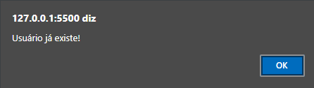

# Create Account

___

## Sobre o projeto

Projeto pessoal simples, para criação de usuários, que verifica se o usuário requerido já existe e emite um alerta que **"Usúario já exite!"** ou  **"Usuário criado com sucesso!"**

## Por que?
O propósito é estudar e aplicar **Java Script** neste projeto, trazendo cada vez mais funcionalidades e tecnologias para ele.

