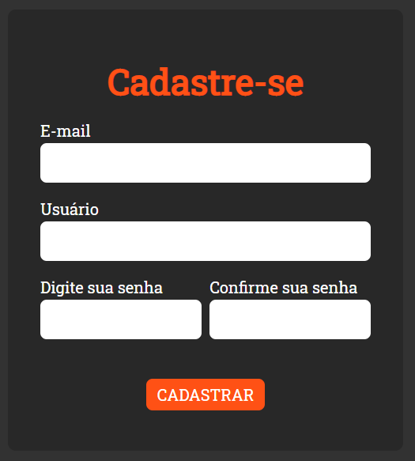

# Create Account




# Sobre o projeto
Projeto pessoal simples, para criação de usuários, que retorna alertas em caso de falha ou sucesso!

## Por que?
O propósito é estudar e aplicar **Java Script** neste projeto, trazendo cada vez mais funcionalidades e tecnologias para ele.

## Observações
A aplicação não está conectada a um servidor e os dados não são salvos no armazenamento local, portanto os usuários cadastrados resetam quando a página é recarregada.

## Funcionalidades

- O usuário cria uma conta para acessar uma aplicação.

# Iniciando

## Pré-requisitos
A aplicação não tem nada além de HTML, CSS e Java Script.

## Clonando
```
$ git clone https://github.com/IanSpigote/create_account
```

## Contribuição

Fiquem avontade para enviar PR's, inclusive gostaria muito que fizessem isso. Qualquer duvida,

Me mande um email: ian.start@gmail.com
